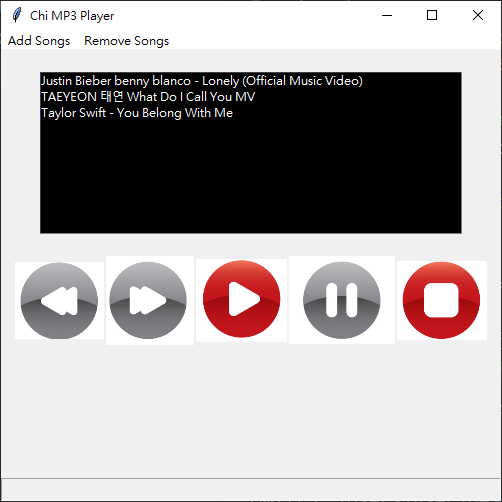

# MP3_Player
Making MP3 player using Python (Tkinter GUI)

##gui from:
https://www.freepik.com/free-vector/multimedia-option-buttons_843619.htm#page=1&query=music%20button&position=49

## Learning How to make a MP3 Player
class website: 

Tutorial 1:
https://www.youtube.com/watch?v=88IJCBKlAPA&t=330s

Tutorial 2:
https://www.youtube.com/watch?v=xknYbrbdKnA

Tutorial 3:
https://www.youtube.com/watch?v=dCXKxgj70R0

Tutorial 4:
https://www.youtube.com/watch?v=1zPyYf_XBD4

Not yet finish~ keep going.. (Total 9)

